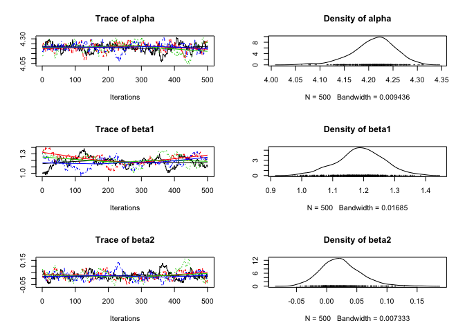
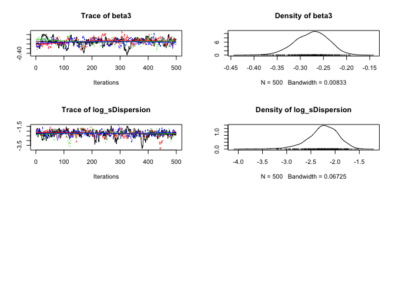
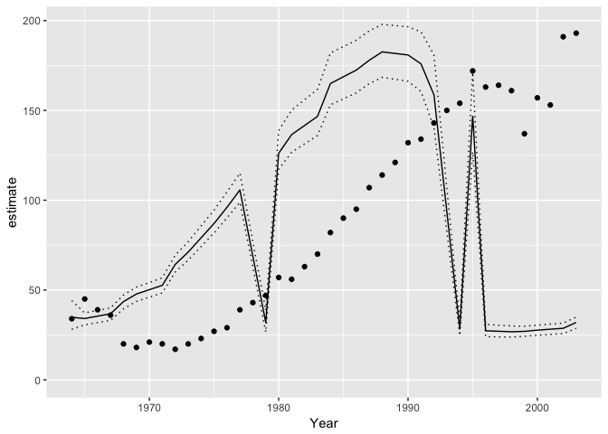

<!-- README.md is generated from README.Rmd. Please edit that file -->
[](https://travis-ci.org/poissonconsulting/jmbr) [](https://ci.appveyor.com/project/poissonconsulting/jmbr) [](https://codecov.io/gh/poissonconsulting/jmbr)

jmbr
====

Introduction
------------

`jmbr` (pronounced jimber) is an R package to facilitate analyses using Just Another Gibbs Sampler (JAGS).

Demonstration
-------------

``` r
library(ggplot2)
library(jmbr)
#> Loading required package: broom
#> Loading required package: mbr
#> Loading required package: lubridate
#> 
#> Attaching package: 'lubridate'
#> The following object is masked from 'package:base':
#> 
#>     date
#> Loading required package: mcmcr
#> Loading required package: coda
#> Loading required package: dplyr
#> 
#> Attaching package: 'dplyr'
#> The following objects are masked from 'package:lubridate':
#> 
#>     intersect, setdiff, union
#> The following objects are masked from 'package:stats':
#> 
#>     filter, lag
#> The following objects are masked from 'package:base':
#> 
#>     intersect, setdiff, setequal, union
#> 
#> Attaching package: 'mcmcr'
#> The following object is masked from 'package:ggplot2':
#> 
#>     derive
#> Loading required package: newdata

options("mb.parallel" = TRUE)
doParallel::registerDoParallel(4)

data <- bauw::peregrine

template <- "
model {
  alpha ~ dnorm(0, 10^-2)
  beta1 ~ dnorm(0, 10^-2)
  beta2 ~ dnorm(0, 10^-2)
  beta3 ~ dnorm(0, 10^-2)

  log_sDispersion ~ dnorm(0, 10^-2)

  log(sDispersion) <- log_sDispersion

  for (i in 1:length(Pairs)) {
    log(ePairs[i]) <- alpha + beta1 * Year[i] + beta2 * Year[i]^2 + beta3 * Year[i]^3
    eDispersion[i] ~ dgamma(1 / sDispersion^2, 1 / sDispersion^2)
    Pairs[i] ~ dpois(ePairs[i] * eDispersion[i])
  }
}"

new_expr <- "
for (i in 1:length(Pairs)) {
  prediction[i] <- exp(alpha + beta1 * Year[i] + beta2 * Year[i]^2 + beta3 * Year[i]^3)
}"

model <- model(template, scale = "Year", new_expr = new_expr, fixed = "^(a|b|l)")

analysis <- analyse(model, data = data)
#> # A tibble: 1 × 8
#>       n     K nsims nchains nsamples           duration  rhat converged
#>   <int> <int> <int>   <int>    <int>     <S4: Duration> <dbl>     <lgl>
#> 1    40     5  4000       4  2000000 0.508044004440308s  1.08      TRUE
analysis <- reanalyse(analysis, rhat = 1.05)
#> # A tibble: 1 × 8
#>       n     K nsims nchains nsamples           duration  rhat converged
#>   <int> <int> <int>   <int>    <int>     <S4: Duration> <dbl>     <lgl>
#> 1    40     5  8000       4  4000000 0.891358852386475s  1.04      TRUE

coef(analysis)
#> # A tibble: 5 × 7
#>              term    estimate         sd      zscore       lower
#> *      <S3: term>       <dbl>      <dbl>       <dbl>       <dbl>
#> 1           alpha  4.21839847 0.03876136 108.8190964  4.13751797
#> 2           beta1  1.18603338 0.06965518  17.0732814  1.06087894
#> 3           beta2  0.01571155 0.03166625   0.5168674 -0.04393087
#> 4           beta3 -0.26799978 0.03583228  -7.5170808 -0.34000586
#> 5 log_sDispersion -2.21588610 0.30678317  -7.3376073 -3.02357840
#> # ... with 2 more variables: upper <dbl>, pvalue <dbl>

plot(analysis)
```



``` r

year <- predict(analysis, new_data = new_data(data, "Year"))

ggplot(data = year, aes(x = Year, y = estimate)) +
  geom_point(data = data, aes(y = Pairs)) +
  geom_line() +
  geom_line(aes(y = lower), linetype = "dotted") +
  geom_line(aes(y = upper), linetype = "dotted") +
  expand_limits(y = 0)
```



Installation
------------

To install from GitHub

    # install.packages("devtools")
    devtools::install_github("poissonconsulting/jmbr")

Contribution
------------

Please report any [issues](https://github.com/poissonconsulting/jmbr/issues).

[Pull requests](https://github.com/poissonconsulting/jmbr/pulls) are always welcome.

Please note that this project is released with a [Contributor Code of Conduct](CONDUCT.md). By participating in this project you agree to abide by its terms.

Inspiration
-----------

-   [jaggernaut](https://github.com/poissonconsulting/jaggernaut)
