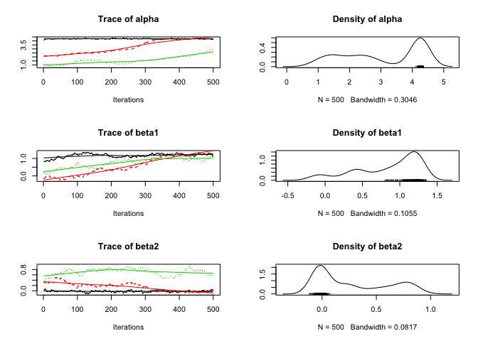
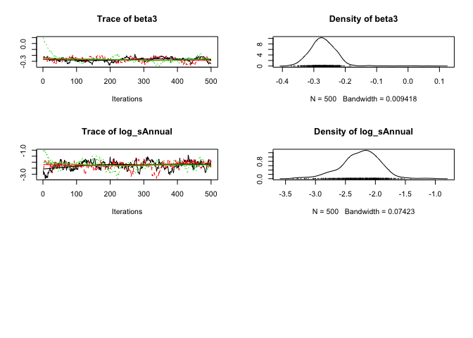
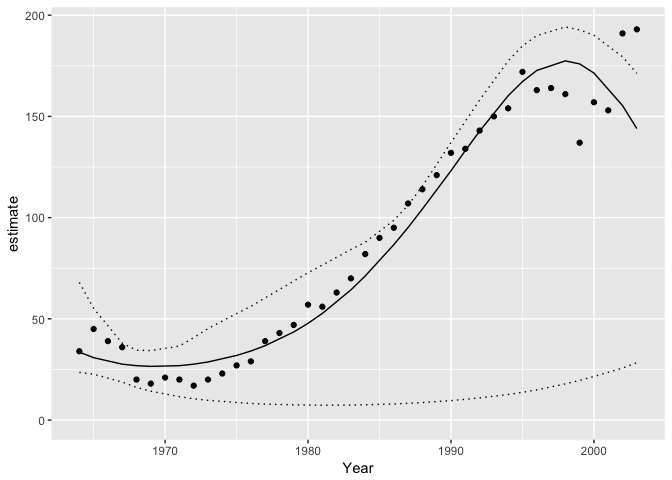

<!-- README.md is generated from README.Rmd. Please edit that file -->
 [](https://travis-ci.org/poissonconsulting/jmbr) [](https://ci.appveyor.com/project/poissonconsulting/jmbr) [](https://codecov.io/gh/poissonconsulting/jmbr) [](https://opensource.org/licenses/MIT)

jmbr
====

Introduction
------------

`jmbr` (pronounced jimber) is an R package to facilitate analyses using Just Another Gibbs Sampler (JAGS). It is part of the [mbr](https://github.com/poissonconsulting/mbr) family of packages.

Demonstration
-------------

``` r
library(magrittr)
library(ggplot2)
library(jmbr)
```

``` r
# define model in JAGS language
model <- model("model {
  alpha ~ dnorm(0, 10^-2)
  beta1 ~ dnorm(0, 10^-2)
  beta2 ~ dnorm(0, 10^-2)
  beta3 ~ dnorm(0, 10^-2)

  log_sDispersion ~ dnorm(0, 10^-2)

  log(sDispersion) <- log_sDispersion

  for (i in 1:length(Pairs)) {
    log(ePairs[i]) <- alpha + beta1 * Year[i] + beta2 * Year[i]^2 + beta3 * Year[i]^3
    eDispersion[i] ~ dgamma(1 / sDispersion^2, 1 / sDispersion^2)
    Pairs[i] ~ dpois(ePairs[i] * eDispersion[i])
  }
}")

# add R code to calculate derived parameters
model %<>% update_model(new_expr = "
for (i in 1:length(Pairs)) {
  prediction[i] <- exp(alpha + beta1 * Year[i] + beta2 * Year[i]^2 + beta3 * Year[i]^3)
}")

model %<>% update_model(scale = "Year")

# analyse
analysis <- analyse(model, data = bauw::peregrine)
#> # A tibble: 1 × 8
#>       n     K nsamples nchains nsims           duration  rhat converged
#>   <int> <int>    <int>   <int> <int>     <S4: Duration> <dbl>     <lgl>
#> 1    40     6     2000       4  4000 0.631420135498047s  1.16     FALSE
analysis %<>% reanalyse(rhat = 1.05)
#> # A tibble: 1 × 8
#>       n     K nsamples nchains nsims          duration  rhat converged
#>   <int> <int>    <int>   <int> <int>    <S4: Duration> <dbl>     <lgl>
#> 1    40     6     2000       4  8000 1.17804932594299s  1.37     FALSE
#> # A tibble: 1 × 8
#>       n     K nsamples nchains nsims          duration  rhat converged
#>   <int> <int>    <int>   <int> <int>    <S4: Duration> <dbl>     <lgl>
#> 1    40     6     2000       4 16000 2.20400643348694s  1.04      TRUE

coef(analysis)
#> # A tibble: 6 × 7
#>              term   estimate         sd     zscore       lower       upper
#> *      <S3: term>      <dbl>      <dbl>      <dbl>       <dbl>       <dbl>
#> 1           alpha  4.2138739 0.03876333 108.728852  4.14094996  4.29635583
#> 2           beta1  1.1949288 0.06920169  17.297585  1.06804548  1.33476351
#> 3           beta2  0.0204495 0.03058227   0.639638 -0.04036223  0.07987298
#> 4           beta3 -0.2729831 0.03539894  -7.738926 -0.34302285 -0.20621540
#> 5 log_sDispersion -2.2231475 0.31166918  -7.263053 -2.99543884 -1.75420698
#> 6     sDispersion  0.1082678 0.03106494   3.500575  0.05001469  0.17304441
#> # ... with 1 more variables: pvalue <dbl>

plot(analysis)
```



``` r
# make predictions by varying year with other predictors held constant
year <- predict(analysis, new_data = "Year")

# plot those predictions
ggplot(data = year, aes(x = Year, y = estimate)) +
  geom_point(data = bauw::peregrine, aes(y = Pairs)) +
  geom_line() +
  geom_line(aes(y = lower), linetype = "dotted") +
  geom_line(aes(y = upper), linetype = "dotted") +
  expand_limits(y = 0)
```



Installation
------------

To install from GitHub

    # install.packages("devtools")
    devtools::install_github("poissonconsulting/jmbr")

Contribution
------------

Please report any [issues](https://github.com/poissonconsulting/jmbr/issues).

[Pull requests](https://github.com/poissonconsulting/jmbr/pulls) are always welcome.

Please note that this project is released with a [Contributor Code of Conduct](CONDUCT.md). By participating in this project you agree to abide by its terms.

Inspiration
-----------

-   [jaggernaut](https://github.com/poissonconsulting/jaggernaut)
