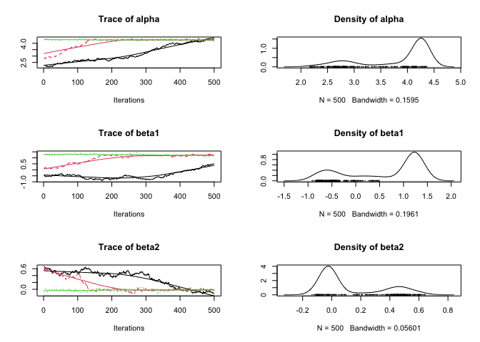

<!-- README.md is generated from README.Rmd. Please edit that file -->
[](https://github.com/joethorley/stability-badges#unstable) [](https://travis-ci.org/poissonconsulting/jmbr) [](https://ci.appveyor.com/project/poissonconsulting/jmbr) [](https://codecov.io/gh/poissonconsulting/jmbr) [](https://opensource.org/licenses/MIT) [](https://cran.r-project.org/package=mbr)

jmbr
====

Introduction
------------

`jmbr` (pronounced jimber) is an R package to facilitate analyses using Just Another Gibbs Sampler (JAGS).

It is part of the [mbr](https://github.com/poissonconsulting/mbr) family of packages.

Demonstration
-------------

``` r
library(magrittr)
library(ggplot2)
library(jmbr)
```

``` r
# define model in JAGS language
model <- model("model {
  alpha ~ dnorm(0, 10^-2)
  beta1 ~ dnorm(0, 10^-2)
  beta2 ~ dnorm(0, 10^-2)
  beta3 ~ dnorm(0, 10^-2)

  log_sAnnual ~ dnorm(0, 10^-2)
  log(sAnnual) <- log_sAnnual

  for(i in 1:nAnnual) {
    bAnnual[i] ~ dnorm(0, sAnnual^-2)
  }

  for (i in 1:length(Pairs)) {
    log(ePairs[i]) <- alpha + beta1 * Year[i] + beta2 * Year[i]^2 + beta3 * Year[i]^3 + bAnnual[Annual[i]]
    Pairs[i] ~ dpois(ePairs[i])
  }
}")

# add R code to calculate derived parameters
model %<>% update_model(new_expr = "
for (i in 1:length(Pairs)) {
  log(prediction[i]) <- alpha + beta1 * Year[i] + beta2 * Year[i]^2 + beta3 * Year[i]^3 + bAnnual[Annual[i]]
}")

# define data types and center year
model %<>% update_model(
  select_data = list("Pairs" = integer(), "Year*" = integer(), Annual = factor()),
  derived = "sAnnual",
  random_effects = list(bAnnual = "Annual"))

data <- bauw::peregrine
data$Annual <- factor(data$Year)

# analyse
analysis <- analyse(model, data = data)
#> # A tibble: 1 x 8
#>       n     K nchains nsims nsamples   ess  rhat converged
#>   <int> <int>   <int> <int>    <int> <int> <dbl>     <lgl>
#> 1    40     5       4  4000     2000    20  3.21     FALSE
analysis %<>% reanalyse(rhat = 1.05)
#> # A tibble: 1 x 8
#>       n     K nchains nsims nsamples   ess  rhat converged
#>   <int> <int>   <int> <int>    <int> <int> <dbl>     <lgl>
#> 1    40     5       4  8000     2000    80  1.12     FALSE

coef(analysis)
#> # A tibble: 5 x 7
#>          term   estimate         sd      zscore       lower       upper
#> *  <S3: term>      <dbl>      <dbl>       <dbl>       <dbl>       <dbl>
#> 1       alpha  4.2139403 0.03931062 107.1869589  4.13209508  4.28936833
#> 2       beta1  1.1892252 0.06595600  18.0517537  1.06407584  1.31922713
#> 3       beta2  0.0167123 0.03060619   0.5342985 -0.04268904  0.07921558
#> 4       beta3 -0.2705118 0.03377259  -8.0295839 -0.34215782 -0.20683192
#> 5 log_sAnnual -2.2628915 0.41526125  -5.6351732 -3.57432685 -1.78365409
#> # ... with 1 more variables: pvalue <dbl>

plot(analysis)
```



``` r
# make predictions by varying year with other predictors including the random effect of Annual held constant
year <- predict(analysis, new_data = "Year")

# plot those predictions
ggplot(data = year, aes(x = Year, y = estimate)) +
  geom_point(data = bauw::peregrine, aes(y = Pairs)) +
  geom_line() +
  geom_line(aes(y = lower), linetype = "dotted") +
  geom_line(aes(y = upper), linetype = "dotted") +
  expand_limits(y = 0)
```


Installation
------------

To install from GitHub

    # install.packages("devtools")
    devtools::install_github("poissonconsulting/jmbr")

Contribution
------------

Please report any [issues](https://github.com/poissonconsulting/jmbr/issues).

[Pull requests](https://github.com/poissonconsulting/jmbr/pulls) are always welcome.

Please note that this project is released with a [Contributor Code of Conduct](CONDUCT.md). By participating in this project you agree to abide by its terms.

Inspiration
-----------

-   [jaggernaut](https://github.com/poissonconsulting/jaggernaut)

Creditation
-----------

-   [JAGS](http://mcmc-jags.sourceforge.net)
