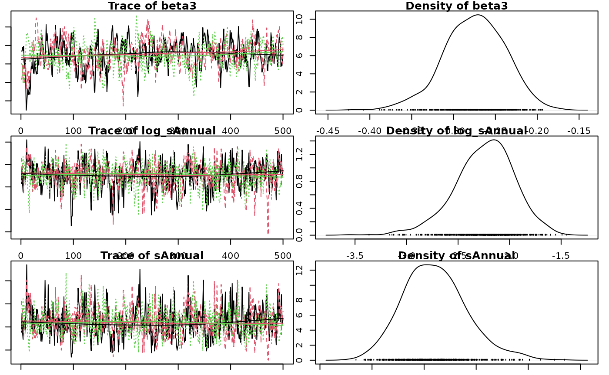

# jmbr

## Introduction

`jmbr` (pronounced jimber) is an R package to facilitate analyses using
Just Another Gibbs Sampler ([`JAGS`](http://mcmc-jags.sourceforge.net)).

It is part of the [mbr](https://github.com/poissonconsulting/mbr) family
of packages.

## Model

The first part of the model is where priors, random effects and the
relationships of interest are set in JAGS.

Example model:

``` r
library(jmbr)
library(embr)
```

``` r
model <- model("model {
# Priors
  alpha ~ dnorm(0, 10^-2) T(0,)
  beta1 ~ dnorm(0, 10^-2)
  beta2 ~ dnorm(0, 10^-2)
  beta3 ~ dnorm(0, 10^-2)

# Random Effect
  log_sAnnual ~ dnorm(0, 10^-2)
  log(sAnnual) <- log_sAnnual
  for(i in 1:nAnnual) {
    bAnnual[i] ~ dnorm(0, sAnnual^-2)
  }

# Prediction of Interest
  for (i in 1:length(Pairs)) {
    log(ePairs[i]) <- alpha + beta1 * Year[i] + beta2 * Year[i]^2 + beta3 * Year[i]^3 + bAnnual[Annual[i]]
    Pairs[i] ~ dpois(ePairs[i])
  }
}")
```

- Priors include the mean and SD value, which is converted to precision
  by doing SD^-2.
- **T(0,)** Truncates the value at zero.

### New Expression

The new expression is written in R Code and is used to calculate derived
parameters.

``` r
new_expr = "
for (i in 1:length(Pairs)) {
  log(prediction[i]) <- alpha + beta1 * Year[i] + beta2 * Year[i]^2 + beta3 * Year[i]^3 + bAnnual[Annual[i]]
  
  fit[i] <- prediction[i] 
  residual[i] <- res_pois(Pairs[i], fit[i])
}"
```

### Modify Data

This section modifies a data frame to the form it will be passed to the
analysis code. The modified data is passed in list form.

``` r
modify_data = function(data) {
 data <- data |>
   select(-Eyasses)

 data
}
```

### Select Data & Random Effects

Select data is a named list specifying the columns to select and their
associated classes and values as well as transformations and scaling
options. Random effects gets the random effects definitions for an
object as a named list, where `bAnnual` refers to the column name
`Annual` in the data.

``` r
select_data = list("Pairs" = c(15L, 200L), 
                   "Year*" = 1L,
                   Annual = factor()),
random_effects = list(bAnnual = "Annual"),
```

All parameters in the data that are included in the model must be listed
here. - If there are values in the Pairs column outside of the specified
range, including NA’s, an error is thrown. - `"Year*" = 1L` indicates
Year is of class integer.

#### Transformations

- `Year-` = subtracts the minimum value (the first year)
- `Year+` = subtracts the average value (centering)
- `Year*` = subtracts the average value and divides by the SD
  (standardizing)

### Initial Values

Initial values of a parameter can be set prior to the analysis as a
single argument function taking the modified data and returning a named
list of initial values.

Unspecified initial values for each chain are drawn from the prior
distributions.

``` r
gen_inits = function(data) {
  inits <-  list()
  inits$ePairs <- data$Pairs + 1
  inits
},
```

### nthin

At the end of the script is where the thinning rate is set, i.e. how
much the MCMC chains should be thinned out before storing them.

Setting `nthin = 1` corresponds to keeping all values.

Setting `nthin = 100` would result in keeping every 100th value and
discarding all other values.

## Full Model

``` r
model <- model("model {
  alpha ~ dnorm(0, 10^-2) 
  beta1 ~ dnorm(0, 10^-2)
  beta2 ~ dnorm(0, 10^-2)
  beta3 ~ dnorm(0, 10^-2)

  log_sAnnual ~ dnorm(0, 10^-2)
  log(sAnnual) <- log_sAnnual
  for(i in 1:nAnnual) {
    bAnnual[i] ~ dnorm(0, sAnnual^-2)
  }

  for (i in 1:length(Pairs)) {
    log(ePairs[i]) <- alpha + beta1 * Year[i] + beta2 * Year[i]^2 + beta3 * Year[i]^3 + bAnnual[Annual[i]]
    Pairs[i] ~ dpois(ePairs[i])
  }
}",

new_expr = "
for (i in 1:length(Pairs)) {
  log(prediction[i]) <- alpha + beta1 * Year[i] + beta2 * Year[i]^2 + beta3 * Year[i]^3 + bAnnual[Annual[i]]
  
  fit[i] <- prediction[i] 
  residual[i] <- res_pois(Pairs[i], fit[i])
}",

modify_data = function(data) {
  data$nObs <- length(data$Annual)
  data
},

select_data = list("Pairs" = c(15L, 200L), 
                   "Year*" = 1L,
                   Annual = factor()),

random_effects = list(bAnnual = "Annual"),

nthin = 10L)
#> Warning: The `x` argument of `model()` character() as of embr 0.0.1.9036.
#> ℹ Please use the `code` argument instead.
#> ℹ Passing a string to model() is deprecated. Use model(code = ...) or
#>   model(mb_code("..."), ...) instead.
#> This warning is displayed once per session.
#> Call `lifecycle::last_lifecycle_warnings()` to see where this warning was
#> generated.

data <- bauw::peregrine
data$Annual <- factor(data$Year)

set_analysis_mode("report")
```

## Analysis Mode

Analysis mode can be set depending on the desired output.

``` r
set_analysis_mode("report")
```

Modes:

- `quick`: To quickly test code runs.
  - Chains = 2L, iterations = 10L, thinning = 1L
- `report`: To produce results for a report.
  - Chains = 3L, iterations = 500L
- `paper`: To produce results for a peer-reviewed paper.
  - Chains = 4L, iterations = 1000L

## Analyse

Analyse or reanalyse the model.

``` r
analysis <- analyse(model, data = data)
#> Registered S3 method overwritten by 'rjags':
#>   method               from 
#>   as.mcmc.list.mcarray mcmcr
#> # A tibble: 1 × 8
#>       n     K nchains niters nthin   ess  rhat converged
#>   <int> <int>   <int>  <int> <int> <int> <dbl> <lgl>    
#> 1    40     6       3    500    10   256  1.01 TRUE
#> Warning in value[[3L]](cond): beep() could not play the sound due to the following error:
#> Error in play.default(x, rate, ...): no audio drivers are available
analysis <- reanalyse(analysis)
#> # A tibble: 1 × 8
#>       n     K nchains niters nthin   ess  rhat converged
#>   <int> <int>   <int>  <int> <int> <int> <dbl> <lgl>    
#> 1    40     6       3    500    10   256  1.01 TRUE
#> Warning in value[[3L]](cond): beep() could not play the sound due to the following error:
#> Error in play.default(x, rate, ...): no audio drivers are available
```

**Analysis Table:**

- **n:** Sample size.
- **K:** Number of parameter terms in the model.
- **nchains:** A count of the number of chains.
- **niters:** Number of iterations. A count of the number of simulations
  to save per chain.
- **ess:** Effective sample size. The number of independent samples with
  the same estimation power as the `n` autocorrelated samples.
  - Measure of how much independent information there is in
    autocorrelated chains.
  - Doubling the thinning rate doubles the `ess`.
- **rhat:** R-hat convergence diagnostic, compares the between- and
  within-chain estimates for model parameters.
  - Evaluates whether the chains agreed on the same values.
  - Close to 1 is ideal.

``` r
par(mar=c(1, 1, 1, 1))
plot(analysis)
```



**Coefficient Table**

Summary table of the posterior probability distribution.

``` r
coef(analysis)
#> Warning: The `simplify` argument of `coef()` must be TRUE as of mcmcr 0.4.1.
#> ℹ The deprecated feature was likely used in the base package.
#>   Please report the issue to the authors.
#> This warning is displayed once per session.
#> Call `lifecycle::last_lifecycle_warnings()` to see where this warning was
#> generated.
#> # A tibble: 6 × 7
#>   term        estimate     sd  zscore   lower   upper   pvalue
#>   <term>         <dbl>  <dbl>   <dbl>   <dbl>   <dbl>    <dbl>
#> 1 alpha         4.27   0.0399 107.     4.18    4.34   0.000666
#> 2 beta1         1.19   0.0764  15.7    1.06    1.36   0.000666
#> 3 beta2        -0.0194 0.0316  -0.611 -0.0787  0.0429 0.519   
#> 4 beta3        -0.273  0.0390  -7.05  -0.361  -0.208  0.000666
#> 5 log_sAnnual  -2.22   0.365   -6.23  -3.14   -1.73   0.000666
#> 6 sAnnual       0.109  0.0330   3.29   0.0433  0.178  0.000666
```

The estimate is the **median** by default.

The zscore is mean / sd.

``` r
coef(analysis, simplify = TRUE)
#> # A tibble: 6 × 5
#>   term        estimate   lower   upper svalue
#>   <term>         <dbl>   <dbl>   <dbl>  <dbl>
#> 1 alpha         4.27    4.18    4.34   10.6  
#> 2 beta1         1.19    1.06    1.36   10.6  
#> 3 beta2        -0.0194 -0.0787  0.0429  0.946
#> 4 beta3        -0.273  -0.361  -0.208  10.6  
#> 5 log_sAnnual  -2.22   -3.14   -1.73   10.6  
#> 6 sAnnual       0.109   0.0433  0.178  10.6
```

The s-value is the **suprisal** value, which is a measure of
directionality with respect to zero.

The s-value is zero (unsurprising) when *p-value* = 1.0 and increases
exponentially as *p* approaches zero.

s = -log_2(p-value) Example: How surprising it would be to throw 10
heads in 10 coin tosses.

A larger s-value provides more evidence against the null hypothesis and
support that the data is in the direction of the posterior.

## Predictions

Example prediction:

Make predictions by varying `Year` with other predictors, including the
random effect of `Annual` held constant.

``` r
year <- predict(analysis, new_data = "Year")
#> Warning in value[[3L]](cond): beep() could not play the sound due to the following error:
#> Error in play.default(x, rate, ...): no audio drivers are available

library(ggplot2)

ggplot(data = year, aes(x = Year, y = estimate)) +
  geom_point(data = bauw::peregrine, aes(y = Pairs)) +
  geom_line() +
  geom_line(aes(y = lower), linetype = "dotted") +
  geom_line(aes(y = upper), linetype = "dotted") +
  expand_limits(y = 0)
```


### Predict

`Predict()` queries the model and tells you what the expected number
would be for that combination of values specified by [new
data](#new-data).

The example below would calculate the annual number of pairs for a
typical number of fledged young of 50 (if `Eyasses` was a parameter in
the model).

``` r
year <- new_data(data, "Year", ref = list(Eyasses = 50L),
                 obs_only = TRUE) %>%
        predict(analysis, new_data = ., ref_data = ref)
```

**Arguments**

- **`new_data`**: Creates a new data frame to calculate the predictions
  for.
- **`ref_data`**: A data frame with 1 row indicating the reference
  values for calculating the effects size.
  - This allows you to calculate the average change relative to
    something else. In this case `ref = list(Eyasses = 50L)`.

Predict can also take the form:

``` r
year <- predict(analysis, new_data = character(0), term = "ePairs")
```

Where **`term`** calls the string of a term in the [new
expression](#new-expression) of the model. By default it is the
`prediction[i]`.

### New Data

Creates a new data frame to be passed to the [predict](#predict)
function.

The idea is that most variables are held **constant** at a reference
level while the variables of interest **vary** across their range.

``` r
year <- new_data(
      data, 
      seq = "Year", 
      ref = list(Eyasses = 50L), 
      obs_only = TRUE) %>%
  predict(analysis, new_data = ., ref_data = ref)
```

**Arguments**

- **`seq`**: The name of columns to vary over. In this example, `Year`.
  - If a factor is named in `seq` then all levels of the factor are
    represented.
- **`ref`**: A named list of reference values for variables not in
  `seq`.
  - In this case, it is holding the column `Eyasses` **constant** at
    50L.
- **`obs_only`**: A list of character vectors indicating the sets of
  variables to only keep **combinations** for, i.e. combinations that
  were observed in the data.
  - If `obs_only = TRUE` then `obs_only` is set to be `seq`.
- **`length_out`**: A count indicating the length of numeric/integer
  sequences.
  - If a factor is named in `seq` then all levels of the factor are
    represented (`length_out` is ignored).
  - The exception to this is if the factor is named in `obs_only`, then
    only observed factor levels are represented in sequences.
